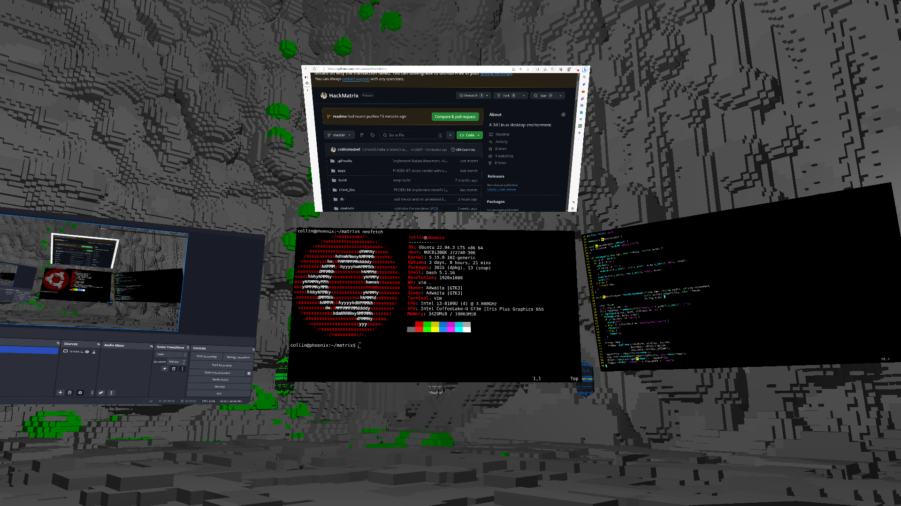
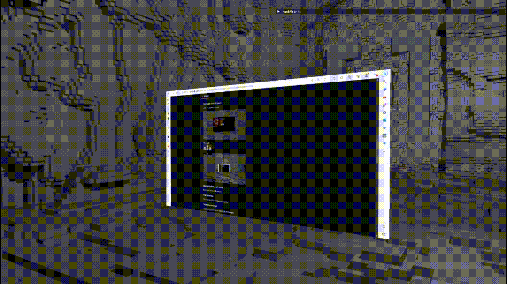

# HackMatrix 




A 3D Linux desktop environment

[](https://paypal.me/HackMatrix?country.x=US&locale.x=en_US)


## Usage

### Navigate the 3d space
Look around with mouse


Move with <br>


### Manually focus window
Look at window and press `r`



### Exit window
When focused on window press `Win+e`


### Window Hotkeys
`Win+Shift+<num>` to set
`Win+<num>` to navigate

### Move window
When focused on window press `Win+m`

### Exit HackMatrix
When not focued on window press `<esc>`

(press `Win+e` first if focused on window)

## Compilation/Installation

### Dependencies

Before compiling or running the program, ensure that you have the following libraries installed on your Linux system:

- ZeroMQ (`libzmq`)
- X11 (`libX11`)
- Xcomposite (`libXcomposite`)
- Xtst (`libXtst`)
- Xext (`libXext`)
- Xfixes (`libXfixes`)
- Protocol Buffers (`libprotobuf`)
- spdlog (`libspdlog`)
- fmt (`libfmt`)
- GLFW (`libglfw`)
- OpenGL (`libGL`)
- pthread (`libpthread`)
- Assimp (`libassimp`)
- SQLite3 (`libsqlite3`)

To install these libraries, you can use your distribution's package manager. Here are the commands for some common distributions:

#### Ubuntu or Debian

```bash
sudo apt-get install libzmq3-dev libx11-dev libxcomposite-dev libxtst-dev libxext-dev libxfixes-dev libprotobuf-dev libspdlog-dev libfmt-dev libglfw3-dev libgl-dev libassimp-dev libsqlite3-dev
```

#### Fedora or CentOS

```bash
sudo dnf install zeromq-devel libX11-devel libXcomposite-devel libXtst-devel libXext-devel libXfixes-devel protobuf-devel spdlog-devel fmt-devel glfw-devel mesa-libGL-devel assimp-devel sqlite-devel
```

#### Arch Linux

```bash
sudo pacman -S zeromq libx11 libxcomposite libxtst libxext libxfixes protobuf spdlog fmt glfw-x11 mesa assimp sqlite
```

Make sure to install these libraries before proceeding with the compilation and execution of the program. The program's build system will link against these libraries using the provided `LIBS` flags:

```makefile
LIBS = -lzmq -lX11 -lXcomposite -lXtst -lXext -lXfixes -lprotobuf -lspdlog -lfmt -Llib -lglfw -lGL -lpthread -lassimp -lsqlite3
```

Once the libraries are installed, you can compile and run the program as described in the compilation and execution sections of this README.

### Installing

#### Prebuilt executable

If you are using an X86 architecture, you can grab the latest [release](https://github.com/collinalexbell/HackMatrix/releases) which has the matrix executable prebuilt for you.

#### Compiling from source

Clone the project, navigate to the project directory and run `make`:

The build process will generate the `matrix` executable in the current directory.

## Running

`matrix` is an X11 window manager, so it needs to be added to your X11 startup file

#### Standard

Add the following line at the end of your `~/.xinitrc` file:

 ```bash
 cd ~/<replace with repository directory>
 exec ~/<replace with repository directory>/matrix
 ```

#### Developer

When developing HackMatrix, I frequently quit and rerun the `matrix` program without restarting X.
I wrote a trampoline program that will restart HackMatrix every time you exit.

 ```bash
 cd ~/<replace with repository directory>
 exec ~/<replace with repository directory>/trampoline
 ```

To restart normally, just press `<esc>`

To exit to a terminal where you can manually start the program (to see stdout) or run a debugger press `<del>`


##### How to use a debugger
- Press `<del>` in `trampoline` mode to escape to terminal
- Open a TTY with CTRL+FN+ALT+2
- Run `tmux` 
- Split the window `CTRL+b %`
- Run `<project root>/devtools/gdb` in one split (and start the program)
- Change to other split `CTLR+b <right arrow>`. Press `<enter>` to make sure shell is accepting input.
- Run `<project root>/devtools/display` to go back to TTY1 (or CTRL+FN+ALT+1 if your machine lets you do that)


### Start X11

After you have edited your `~/.xinitrc` just run `startx` to boot HackMatrix
