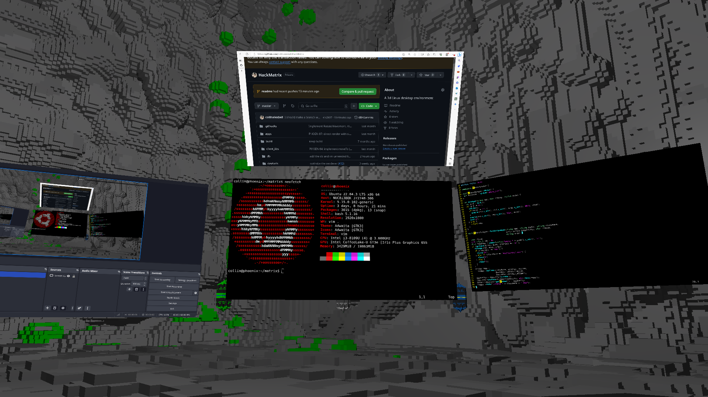
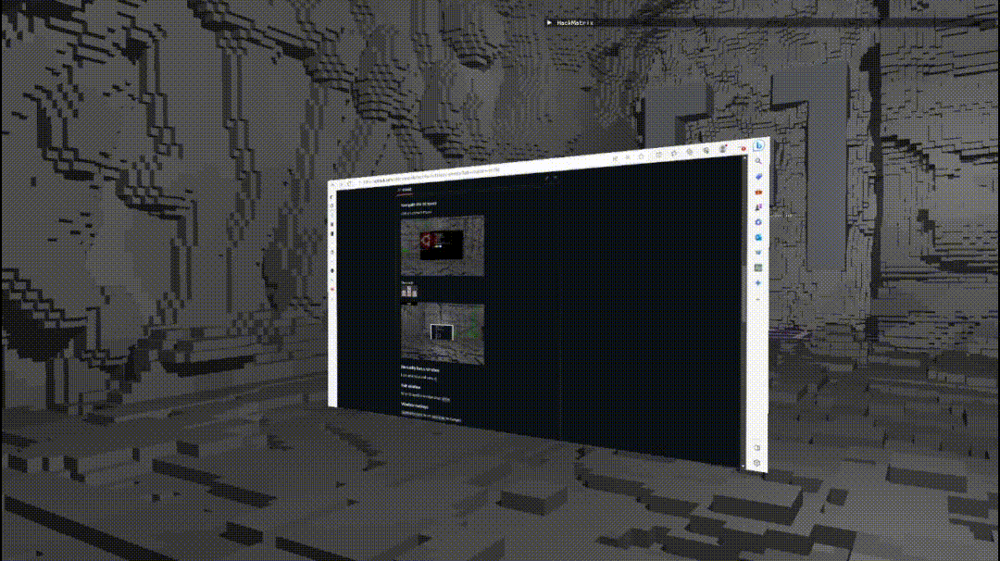

# HackMatrix

*WARNING* this project is a bit of a mess right now. I merged a vibe coded migration to Wayland that I'm in the process of refactoring



A 3D Linux desktop environment (which can also be a game engine)

<a href="https://www.youtube.com/watch?v=L6xDqNhGeEM">Watch a demo</a>

[Join the discord](https://discord.gg/Kx2rbJ8JCM)

## Usage

### Navigate the 3d space
Look around with the mouse


Move with <br>


### Open a window

HackMatrix uses `wofi`.

`d` is mapped to movement, so press `v` without a modifier

Type your program name and press `<enter>`

The window will open up in the position you are looking at.

Press `r` to [focus](#manually-focus-window) on the window


### Manually focus window
Look at the window and press `r`

__warning__: sometimes this doesn't work temporarily because of a bug.

If that happens just use Super+1 to focus a window and then manual focus will work again.




### Exit window
When focused on a window press `Super+e`


### Window Hotkeys

Windows are auto hotkeyed in the order they are created.

`Super+<num>` to navigate


### Close a window

When window has focus, press `Super+q`

### Exit HackMatrix
When not focused on a window press `<esc>`

(press `Super+e` first if focused on a window)

### Take a screenshot

Press `p` to save a screenshot into the `<project_dir>/screenshots` folder

### Hackmatrix menu
There is a small menu at the top of HackMatrix.

You can use this to inspect and modify entities (the game engine aspect of HackMatrix)

When not focused on an app, press `f` to enter into mouse mode

Click the arrow at the left of the menu

Navigate to the Entity Editor

See the [wiki page](https://github.com/collinalexbell/HackMatrix/wiki/Game-Engine) for more info about the game engine and how to use the editor.

## Compilation/Installation

### Dependencies

Before compiling or running the program, ensure that you have the following libraries installed on your Linux system:
Even for the wayland port you will need to have X11 installed until I finish the refactor.

- wayland-protocols (`wayland-protocols`) (also pulls in wayland core)
- wofi (`wofi`)
- ZeroMQ (`libzmq`)
- Protocol Buffers (`libprotobuf`)
- spdlog (`libspdlog`)
- fmt (`libfmt`)
- GLFW (`libglfw`)
- OpenGL (`libGL`)
- pthread (`libpthread`)
- Assimp (`libassimp`)
- SQLite3 (`libsqlite3`)
- XWinInfo (`x11-utils`)
- xdotool (`xdotool`)
- Protobuf (`protobuf1`)
- Base development tools (`basedevel`)

This project still unfortunately has X11 cruft in it due to a semi botch AI slop migration that intended to add wayland support instead of replacing X11 with wayland. Will be cleaned up soon.
- X11 (`libX11`)
- Xcomposite (`libXcomposite`)
- Xtst (`libXtst`)
- Xext (`libXext`)
- Xfixes (`libXfixes`)


To install these libraries, you can use your distribution's package manager. Here are the commands for some common distributions:

#### Ubuntu or Debian

```bash
sudo apt-get install wofi wayland-protocols rofi xdotool x11-utils protobuf-compiler build-essential libzmq3-dev libx11-dev libxcomposite-dev libxtst-dev libxext-dev libxfixes-dev libprotobuf-dev libspdlog-dev libfmt-dev libglfw3-dev libgl-dev libassimp-dev libsqlite3-dev pkgconf
```

#### Fedora or CentOS

```bash
sudo dnf install wayland-protocols wayland wofi rofi xdotool xorg-x11-utils protobuf-compiler @development-tools zeromq-devel libX11-devel libXcomposite-devel libXtst-devel libXext-devel libXfixes-devel protobuf-devel spdlog-devel fmt-devel glfw-devel mesa-libGL-devel assimp-devel sqlite-devel
```

#### Arch Linux

I'm currently working on an issue with protobuf compilation errors for Arch. [This PR](https://github.com/collinalexbell/HackMatrix/pull/48) shows how to resolve the issue.
If you are on Arch and would like to help with a PR that I can get merged into master, try out [this PR](https://github.com/collinalexbell/HackMatrix/pull/55) and let me know in the PR comments if it works for you. It would be much appreciated!

```bash
sudo pacman -S --needed wofi wayland-protocols xdotool rofi xorg-server xorg-xinit xorg-xwininfo xorg-xrandr protobuf base-devel zeromq libx11 libxcomposite libxtst libxext libxfixes spdlog fmt glfw-x11 mesa assimp sqlite
```
#### Gentoo
```bash
 sudo emerge --autounmask-write gui-apps/wofi dev-libs/wayland-protocols x11-misc/rofi net-libs/zeromq x11-libs/libX11 x11-libs/libXcomposite x11-libs/libXtst x11-libs/libXext x11-libs/libXfixes dev-libs/protobuf dev-libs/spdlog dev-libs/libfmt media-libs/glfw x11-libs/libGLw  dev-db/sqlite x11-misc/xdotool dev-libs/pthreadpool media-libs/assimp dmenu
```
> [!NOTE]
> you may have some issues with use flags and or masked packages. you will have to figure that out on your own system.

## Building


```bash
git submodule update --init
cd wlroots
meson build/
ninja -C build/
cd ..
mkdir -p build
cd build
cmake ..
make -j
```

## Running

Run `./launch`. 

### How to get the client_libraries working
run `scripts/install-python-clientlib.sh` from the HackMatrix root to do an automated install

see the script below for what it runs
#### Python
```bash
# Install python hackMatrix lib
python -m venv hackmatrix_python
cd hackmatrix_python
source bin/activate
cd client_libs/python
pip install .
cd ../..

# Testing
python scripts/player-move.py
```


# Problems

## Trackpad disabled while typing (moving)
```
xinput list | grep -i touchpad
# grab the id and replace <id> below with it
xinput set-prop <id> "libinput Disable While Typing Enabled" 0
```
