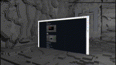

# HackMatrix 

[](https://www.youtube.com/watch?v=L6xDqNhGeEM)


A 3D Linux desktop environment (which can also be a game engine)

[](https://paypal.me/HackMatrix?country.x=US&locale.x=en_US)


[Join the discord](https://discord.gg/Kx2rbJ8JCM)


## Usage

### Navigate the 3d space
Look around with mouse


Move with <br>


### Open a window

HackMatrix uses `dmenu`.

`d` is mapped to movement, so press `v` without a modifier

Type your program name and press `<enter>`

The window will open up in the position you are looking at.

Press `r` to [focus](#manually-focus-window) on the window 


### Manually focus window
Look at window and press `r`

__warning__: sometimes this doesn't work temporarily because of a bug.

If that happens just use Super+1 to focus a window and then manual focus will work again.




### Exit window
When focused on window press `Super+e`


### Window Hotkeys

Windows are auto hotkeyed in the order they are created.

`Super+<num>` to navigate


### Exit HackMatrix
When not focued on window press `<esc>`

(press `Super+e` first if focused on window)

### Take a screenshot

Press `p` to save a screenshot into `<project_dir>/screenshots` folder

### Hackmatrix menu
There is a small menu up at the top of HackMatrix.

You an use this to inspect and modify entities (the game engine aspect of HackMatrix)

When not focused on an app, press `f` to enter into mouse mode

Click the arrow at the left of the menu

Navigate to the Entity Editor

See the [wiki page](https://github.com/collinalexbell/HackMatrix/wiki/Game-Engine) for more info about the game engine and how to use the editor.

## Compilation/Installation

### Dependencies

Before compiling or running the program, ensure that you have the following libraries installed on your Linux system:

- ZeroMQ (`libzmq`)
- X11 (`libX11`)
- Xcomposite (`libXcomposite`)
- Xtst (`libXtst`)
- Xext (`libXext`)
- Xfixes (`libXfixes`)
- Protocol Buffers (`libprotobuf`)
- spdlog (`libspdlog`)
- fmt (`libfmt`)
- GLFW (`libglfw`)
- OpenGL (`libGL`)
- pthread (`libpthread`)
- Assimp (`libassimp`)
- SQLite3 (`libsqlite3`)
- XWinInfo (`x11-utils`)
- xdotool (`xdotool`)
- Protobuf (`protobuf1`)
- Base development tools (`basedevel`)

To install these libraries, you can use your distribution's package manager. Here are the commands for some common distributions:

#### Ubuntu or Debian

```bash
sudo apt-get install xdotool x11-utils protobuf-compiler build-essential libzmq3-dev libx11-dev libxcomposite-dev libxtst-dev libxext-dev libxfixes-dev libprotobuf-dev libspdlog-dev libfmt-dev libglfw3-dev libgl-dev libassimp-dev libsqlite3-dev
```

#### Fedora or CentOS

```bash
sudo dnf install xdotool xorg-x11-utils protobuf-compiler @development-tools zeromq-devel libX11-devel libXcomposite-devel libXtst-devel libXext-devel libXfixes-devel protobuf-devel spdlog-devel fmt-devel glfw-devel mesa-libGL-devel assimp-devel sqlite-devel
```

#### Arch Linux

I'm currently working on an issue with protobuf compilation errors for arch. [This PR](https://github.com/collinalexbell/HackMatrix/pull/48) shows how to resolve the issue.
If you are on Arch and would like to help with a PR that I can get merged into master, try out [this PR](https://github.com/collinalexbell/HackMatrix/pull/55) and let me know in the PR comments if it works for you. It would be much appreciated!

```bash
sudo pacman -S xdotool dmenu xorg-server xorg-xwininfo xorg-xrandr protobuf base-devel zeromq libx11 libxcomposite libxtst libxext libxfixes spdlog fmt glfw-x11 mesa assimp sqlite
```

Make sure to install these libraries before proceeding with the compilation and execution of the program. The program's build system will link against these libraries using the provided `LIBS` flags:

```makefile
LIBS = -lzmq -lX11 -lXcomposite -lXtst -lXext -lXfixes -lprotobuf -lspdlog -lfmt -Llib -lglfw -lGL -lpthread -lassimp -lsqlite3
```

Once the libraries are installed, you can compile and run the program as described in the compilation and execution sections of this README.

### Installing

#### Compiling from source

Right now this is the only way to install the project.

Clone the project (with submodules `git clone --recurse-submodules`), navigate to the project directory and run `make`:

The build process will generate the `matrix` executable in the current directory.

## Running

`matrix` is an X11 window manager, so it needs to be added to your X11 startup file

#### Standard

HackMatrix v1 is prone to crash, so you may want to run in [developer](#developer) mode to auto-restart HackMatrix if it crashes.

Add the following line at the end of your `~/.xinitrc` file:

 ```bash
 cd ~/<replace with repository directory>
 exec ~/<replace with repository directory>/matrix
 ```

#### Developer

When developing HackMatrix, I frequently quit and rerun the `matrix` program without restarting X.
I wrote a trampoline program that will restart HackMatrix every time you exit.

 ```bash
 cd ~/<replace with repository directory>
 exec ~/<replace with repository directory>/trampoline
 ```

To restart normally, just press `<esc>`

To exit to a terminal where you can manually start the program (to see stdout) or run a debugger press `<del>`

To exit the `trampoline`, run `pkill trampoline` in the terminal


##### How to use a debugger
- Press `<del>` in `trampoline` mode to escape to terminal
- Open a TTY with CTRL+FN+ALT+2
- Run `tmux` 
- Split the window `CTRL+b %`
- Run `<project root>/devtools/gdb` in one split (and start the program)
- Change to other split `CTLR+b <right arrow>`. Press `<enter>` to make sure shell is accepting input.
- Run `<project root>/devtools/display` to go back to TTY1 (or CTRL+FN+ALT+1 if your machine lets you do that)


### Start X11 with startx

After you have edited your `~/.xinitrc` ([see this](#running)) just run `startx` to boot HackMatrix

### Start X11 with graphical session manager

If you use something like GDM, you will have to create a .desktop file that calls `<project_dir>/matrix` or `<project_dir>`/trampoline.

See [this article](https://www.maketecheasier.com/customize-the-gdm-sessions-list/) for how to do that.

At some point I may install a session manager myself and I'll be able to write this desktop config.

If you create a working config yourself, it would be great if you PR'd it!
